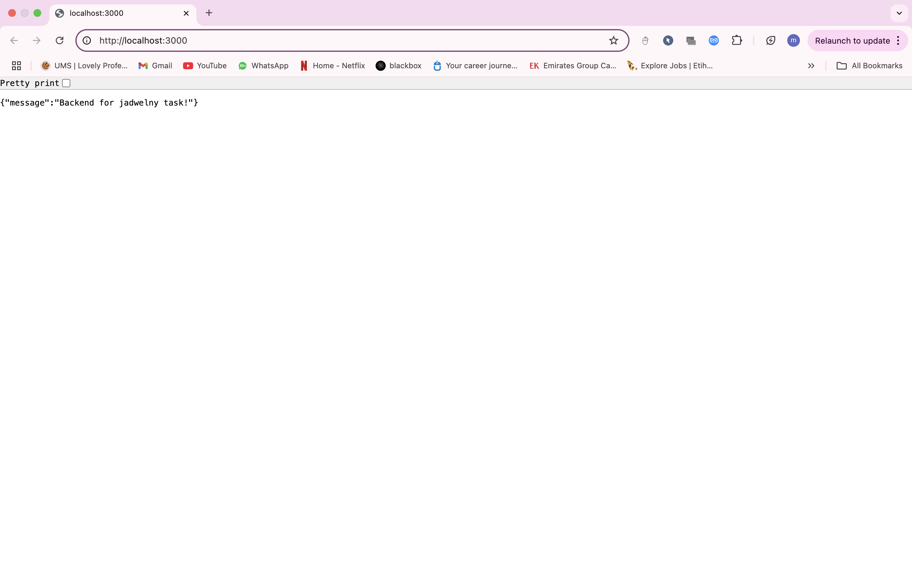
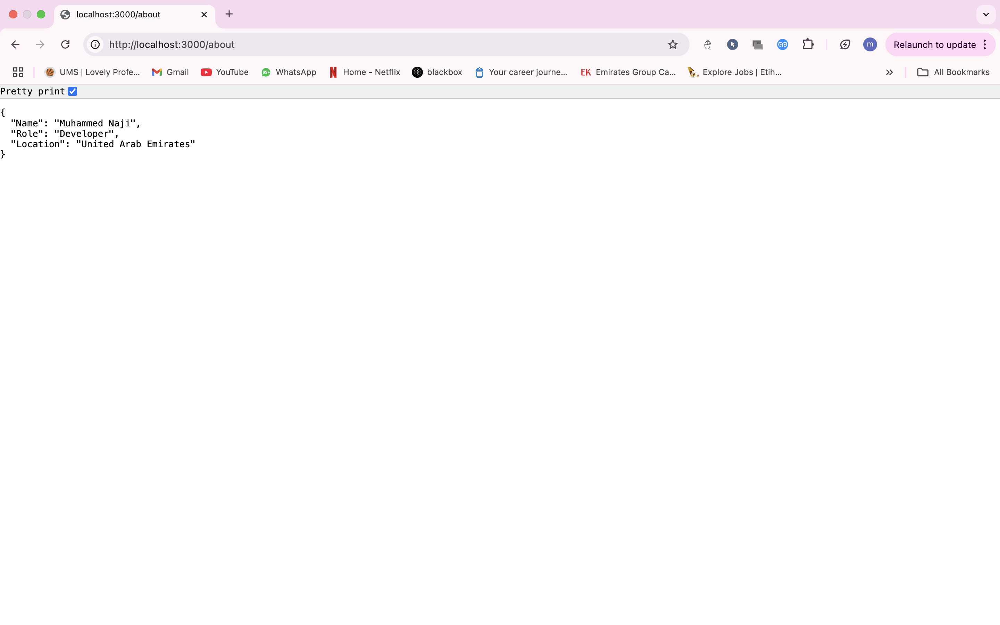
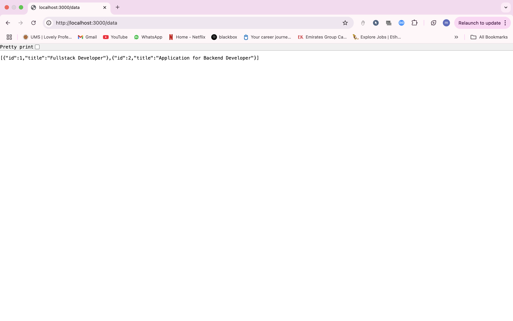
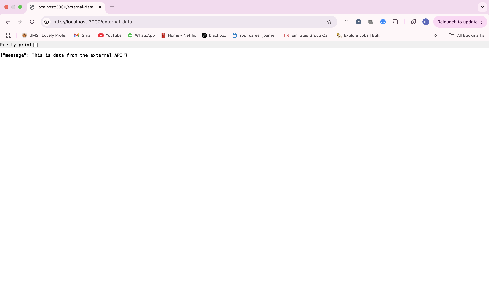

# Backend for Jadwelny Task

This is a backend project that consists of two Express servers:
- **Main Backend**: A server that handles basic routes, returns bio information, fetches local data, and calls data from an external API.
- **External API**: A simple server that provides dummy data as an external API.

## Features
- **Main Backend API**:
  - **`GET /`**: A welcome message in JSON format.  
    
  - **`GET /about`**: Information about the developer (bio).  
    
  - **`GET /data`**: Returns locally stored data.  
    
 
  
- **External API**:
   - **`GET /external-data`**: Fetches data from the external API running on a different port.  
    

## Prerequisites
- Node.js (>= 16.x)
- npm (>= 8.x)

## Setup Instructions

1. **Clone the repository**:
   Clone the repository to your local machine using the following command:
   
   git clone <https://github.com/Naji4054/Jadwelny-Task.git>

   cd project-folder

2. **Project Structure**:
The project consists of two main parts:

Main Backend: The main backend server is located in the jadwelny-backend folder.

External API: The external API server is located in the external-api folder
 
3. **Install Dependencies**:
Install the required dependencies for both the backend and external API

For the Backend Server (inside the jadwelny-backend folder):

cd jadwelny-backend
npm install express axios

For the External API Server (inside the external-api folder):

cd external-api
npm install express

4. **Run the External API Server**:
start the external API server that serves dummy data.

Navigate to the external-api folder and run:

cd external-api
node index.js

This will start the external API server, and it will be running on http://localhost:4000

5. **Run the Main Backend Server**:
start the main backend server.

Navigate to the jadwelny-backend folder and run:

cd jadwelny-backend
node server.js

This will start the main backend server, and it will be running on http://localhost:3000.

**Available Route**
Main Backend Server (http://localhost:3000):

